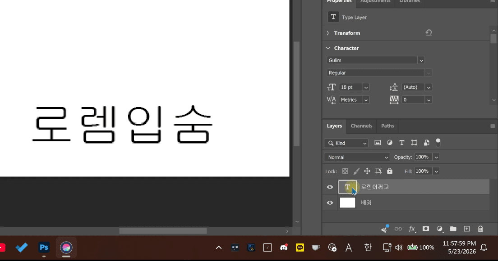

# 한영지킴이

한영지킴이는 Adobe Photoshop과 Illustrator에서 작업할 때 `가`/`A` 입력 상태 때문에 단축키가 먹히지 않는 불편함을 줄이기 위해 만든 Windows 트레이 앱입니다.

디자인 작업 중 텍스트 레이어 내용을 수정하거나 레이어명을 바꾼 뒤, 입력 상태가 `가`로 남아 있으면 `V`, `T`, `Ctrl+S` 같은 단축키를 누르려 해도 의도대로 동작하지 않을 때가 있습니다. 한영지킴이는 이런 순간을 감지해 다시 영문 입력 상태로 되돌려 줍니다.

## 주요 기능

- Photoshop 또는 Illustrator로 돌아왔을 때 영문 입력 상태로 되돌립니다.
- 텍스트 레이어 내용을 수정한 뒤 영문 입력 상태로 되돌립니다.
- 레이어 이름을 바꾼 뒤 영문 입력 상태로 되돌립니다.
- 필요하면 마우스 이동 시에도 영문 입력 상태로 되돌릴 수 있습니다.
- 트레이 아이콘 메뉴에서 각 동작을 켜고 끌 수 있습니다.
- Windows 시작 시 자동 실행할 수 있습니다.
- 별도 창을 띄우지 않고 작업 흐름을 방해하지 않도록 조용히 동작합니다.

## 이런 분께 좋습니다

- Photoshop이나 Illustrator에서 한글 텍스트 작업과 단축키 작업을 자주 오가는 디자이너
- 텍스트 수정 후 단축키가 먹히지 않아 `가`/`A` 상태를 계속 확인해야 했던 사용자
- 레이어 이름을 한글로 정리하면서도 작업 단축키는 빠르게 쓰고 싶은 사용자

## 기본 사용 흐름

1. 한영지킴이를 실행합니다.
2. Photoshop 또는 Illustrator에서 평소처럼 작업합니다.
3. 텍스트 레이어 내용이나 레이어명을 수정합니다.
4. 수정이 끝난 뒤 단축키를 누르면 영문 입력 상태로 돌아간 상태에서 작업을 이어갈 수 있습니다.

트레이 아이콘을 우클릭하면 포커스 복귀, 텍스트 편집 후 전환, 레이어 이름 변경 후 전환, 마우스 이동 전환, 시작 시 자동 실행 같은 옵션을 조정할 수 있습니다.

## 라이선스

LidGuard는 [MIT 라이선스](LICENSE.txt)로 배포됩니다.

## 제작자

[이호원 (airtaxi)](https://github.com/airtaxi)이 만들었습니다.

OpenAI Codex의 도움을 받아 제작되었습니다.
